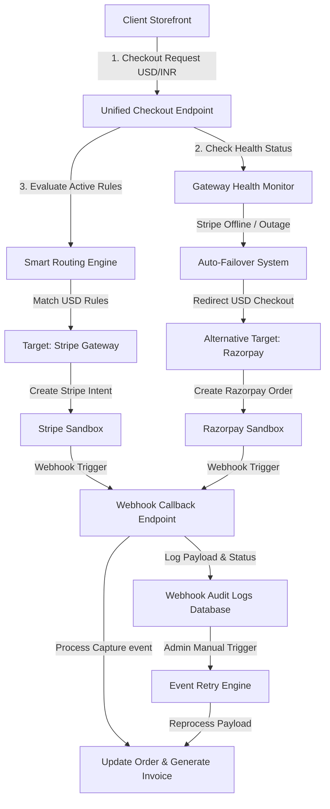

# SmartPay: Multi-Gateway Payment Orchestration & Integration Platform

SmartPay is a production-ready, enterprise-grade multi-gateway payment integration and orchestration platform. It abstracts payment processors (Stripe, Razorpay, and PayPal) into a single, unified interface, featuring dynamic smart routing rules, automatic outage health failovers, a customer portal, and a webhook audit log with manual retry capabilities.

---

## 🏗️ Architecture Flow

The following diagram illustrates how SmartPay processes checkouts, evaluates smart routing rules, handles simulated gateway outages, and audits webhooks:



---

## 🌟 Core Features

### 1. Unified Payment Adapter API
* Exposes a single, unified POST checkout endpoint `/api/payments/checkout` taking care of token generation, signature validation, and payload formatting across multiple gateways behind the scenes.

### 2. Dynamic Smart Routing Engine
* Admins can configure custom routing rules (prioritized lists) matching currencies and transaction amount ranges to target specific gateways.
* Rules are evaluated dynamically in real time on checkout requests.

### 3. Gateway Health Monitor & Auto-Failover
* Active monitoring of gateway latency and error rates.
* Admins can simulate outages by toggling gateways offline from the control dashboard.
* If a primary routed gateway is down, checkouts automatically fail over to healthy alternative channels (e.g. USD checkout seamlessly switches from Stripe to Razorpay) ensuring 100% uptime.

### 4. Customer Portal Storefront
* Customers can browse catalog items, edit carts, apply coupon discounts, select preferred checkout currencies, simulate sandbox credit card inputs, view transaction histories, and securely download PDF invoices.

### 5. Webhook Event Log & Retry Dashboard
* Real-time audit log of all incoming payment callbacks (success, failed, refunds).
* Detailed database records containing source gateway, event type, status, and raw JSON payloads.
* Admin panel interface for viewing payloads, tracking errors, and manually re-triggering failed callback runs (e.g. recovering from database outages during invoice generation).

---

## 🛠️ Technology Stack

* **Backend Dev Framework**: Node.js & Express
* **Database & ORM**: MongoDB & Mongoose (supports MongoDB memory server fallbacks in local dev)
* **Frontend Web App**: React, Vite, Vanilla glassmorphic CSS
* **Test Suite**: Jest, Supertest
* **PDF Utility**: PDFKit
* **Mailer Client**: Nodemailer

---

## 📁 Repository Structure

```
├── client/
│   └── react-admin/          # React Admin Dashboard & Customer Portal
│       ├── src/
│       │   ├── api/          # Axios/Fetch API connector methods
│       │   ├── views/        # Admin and Customer dashboard panel views
│       │   ├── App.jsx       # App shell, routing, and logins switcher
│       │   └── index.css     # Glassmorphic Dark Design stylesheet
├── docs/
│   ├── api_spec.md           # API endpoints specifications
│   └── deployment.md         # Extended deployment & configurations guide
├── server/
│   ├── config/               # Database connection and default seeder
│   ├── controllers/          # Request handlers for auth, cart, payments, webhooks
│   ├── middleware/           # Security, Auth validations, and rate-limiters
│   ├── models/               # MongoDB models schemas (Order, Transaction, Rules, logs)
│   ├── routes/               # Express endpoints routers mapping
│   ├── services/             # Core engines (routing service, gateways, invoices, emails)
│   └── tests/                # Jest mock test suite coverage
└── README.md                 # Primary system documentation
```

---

## 🔌 API Endpoint Reference

Detailed body parameters and specifications can be reviewed in the [API Spec Document](docs/api_spec.md).

### Authentication Endpoints
* `POST /api/auth/register` (Public) - Create customer account
* `POST /api/auth/login` (Public) - Authenticate and get JWT token

### Product Catalog
* `GET /api/products` (Public) - Fetch active product catalog (supports query filters `search` and `category`)
* `POST /api/products` (Admin Only) - Create new products

### Cart & Discount Code Systems
* `GET /api/cart` (Customer Only) - Retrieve current pending cart details
* `POST /api/cart/add` (Customer Only) - Add items or increment product quantity
* `DELETE /api/cart/remove` (Customer Only) - Remove item from cart
* `POST /api/coupons/apply` (Customer Only) - Apply active discount code coupon

### Unified Checkout & Payments
* `POST /api/payments/checkout` (Customer Only) - Unified entrypoint that runs the smart router to dynamically prepare Stripe Payment Intents or Razorpay Orders.
* `POST /api/payments/stripe/confirm` (Customer Only) - Process and capture Stripe callbacks.
* `POST /api/payments/razorpay/verify` (Customer Only) - Verify signatures and process Razorpay captures.
* `GET /api/payments/transactions` (Customer Only) - View purchase histories.
* `GET /api/payments/invoice/:orderId` (Customer/Admin) - Securely serve PDF invoices.

### Gateway Status Override Controls
* `GET /api/gateways/status` (Admin/Customer) - Query all gateway statuses and metrics.
* `POST /api/gateways/status/toggle` (Admin Only) - Simulates a gateway outage override (toggles status: `online` / `offline`).

### Webhook Event Logger & Audit Retries
* `POST /api/webhooks/razorpay` (Public) - Raw callback notification handler.
* `GET /api/webhooks/logs` (Admin Only) - Query chronological audit history.
* `POST /api/webhooks/logs/:id/retry` (Admin Only) - Manually reprocess failed callbacks.

---

## 🚀 Getting Started (Quick Start)

For detailed settings, env overrides, and Docker specifications, please consult the [Deployment & Configurations Guide](file:///c:/Users/Sahil.yadav/Desktop/SmartPay-Multi-Gateway-Payment-Integration-Platform/docs/deployment.md).

### 1. Backend Server Setup
1. Open a terminal and navigate to the backend directory:
   ```bash
   cd server
   npm install
   ```
2. Copy the example environment file:
   ```bash
   cp .env.example .env
   ```
   *(Configure variables such as `STRIPE_SECRET_KEY`, `RAZORPAY_KEY_ID`, or SMTP settings as desired).*
3. Launch the development server:
   ```bash
   npm run dev
   ```
   *The server starts on `http://localhost:5000`. If local MongoDB is missing, it will automatically launch an in-memory database instance for testing.*

### 2. Frontend React Panel Setup
1. Open a separate terminal and navigate to the react directory:
   ```bash
   cd client/react-admin
   npm install
   ```
2. Launch Vite development server:
   ```bash
   npm run dev
   ```
   *The frontend dashboard will load at `http://localhost:3000`.*

---

## 🧪 Running Automated Tests

We maintain strict test suite coverage utilizing Jest mock engines:
1. Navigate to the server folder:
   ```bash
   cd server
   ```
2. Run the automated testing command:
   ```bash
   npm run test
   ```

---

## 🛡️ Default User Credentials

* **System Administrator Portal**:
  * Email: `admin@smartpay.io`
  * Password: `admin123`
* **Customer Storefront Portal**:
  * Register a new user on the login screen or sign in with an admin-seeded user.
