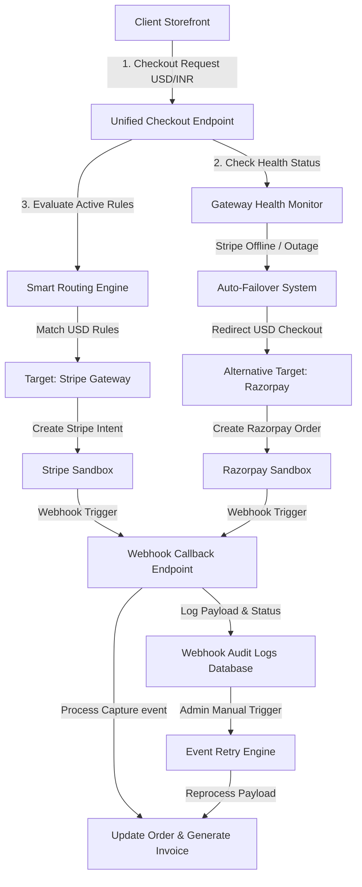

# SmartPay: Multi-Gateway Payment Orchestration & Integration Platform

SmartPay is a production-ready, enterprise-grade multi-gateway payment integration and orchestration platform. It abstracts payment processors (Stripe, Razorpay, and PayPal) into a single, unified interface, featuring dynamic smart routing rules, automatic outage health failovers, a customer portal, and a webhook audit log with manual retry capabilities.

---

## 🏗️ Architecture Flow

The following diagram illustrates how SmartPay processes checkouts, evaluates smart routing rules, handles simulated gateway outages, and audits webhooks:



---

## 🌟 Core Features

### 1. Unified Payment Adapter API
* Exposes a single, unified POST checkout endpoint `/api/payments/checkout` taking care of token generation, signature validation, and payload formatting across multiple gateways (Stripe, Razorpay, and PayPal) behind the scenes.

### 2. Dynamic Smart Routing Engine & Simulation Sandbox
* Admins can configure custom routing rules (prioritized lists) matching currencies and transaction amount ranges to target specific gateways.
* Rules are evaluated dynamically in real time on checkout requests.
* Includes an **interactive simulation sandbox** console in the Admin panel, allowing administrators to dry-run transaction parameters (amount, currency) and toggle simulated gateway status overrides to preview step-by-step routing evaluation traces.

### 3. Gateway Health Monitor & Auto-Failover
* Active monitoring of gateway latency and error rates.
* Admins can simulate outages by toggling gateways offline globally from the control dashboard.
* If a primary routed gateway is down, checkouts automatically fail over to healthy alternative channels (e.g., USD checkout seamlessly switches from Stripe to Razorpay) ensuring 100% uptime.

### 4. Customer Portal Storefront
* Customers can browse catalog items, edit carts, apply discount coupon codes, select preferred checkout currencies, simulate sandbox credit card inputs, view transaction histories, and securely download PDF invoices.

### 5. Webhook Event Log & Retry Dashboard
* Real-time audit log of all incoming payment callbacks (success, failed, refunds).
* Detailed database records containing source gateway, event type, status, and raw JSON payloads.
* Admin panel interface for viewing payloads, tracking errors, and manually re-triggering failed callback runs (e.g., recovering from database outages during invoice generation).

### 6. Dynamic FX Markup & Currency Converter
* Automatically handles cross-currency checkouts when the preferred customer currency differs from the base catalog currency (USD).
* Customizable exchange rate conversions and profit markup percentage splits (e.g., charging 2.5% fee on USD -> INR conversions) configured by administrators.
* Logs original cart amounts, exchange rates, markup percentages, markup fees, and final converted amounts inside Order & Transaction records.
* Interactive FX Converter playground widget in the Admin panel to simulate, dry-run, and audit conversions.

### 7. Coupons & Discount Code Management
* Administrative dashboard to create, update, and manage coupon discount rules (supporting both percentage and fixed-amount discounts, custom expiry dates, and usage limits).
* Customers can apply coupons to their carts to instantly discount and recalculate totals during checkout.

### 8. Refund Management System
* Process and initiate partial or full refunds on transactions directly through the admin dashboard.
* Automatically updates order states and logs refund transaction history records.

### 9. Customer Subscription Portal
* Supports subscription plans (Basic & Premium) with customizable billing frequencies (Monthly & Annual).
* Automatically tracks, manages, and updates recurring client subscription statuses and payment history.

### 10. Dashboard Analytics & Reporting
* Visualized metrics reporting for administrators, including total payment volume, transaction volumes, gateway distribution, active rules overview, refund summaries, and performance logs.

---

## 🛠️ Technology Stack

* **Backend Dev Framework**: Node.js & Express
* **Database & ORM**: MongoDB & Mongoose (supports MongoDB memory server fallbacks in local dev)
* **Frontend Web App**: React, Vite, Vanilla glassmorphic CSS
* **Test Suite**: Jest, Supertest
* **PDF Utility**: PDFKit
* **Mailer Client**: Nodemailer

---

## 📁 Repository Structure

```
├── client/
│   └── react-admin/          # React Admin Dashboard & Customer Portal
│       ├── src/
│       │   ├── api/          # Axios API helper methods (api.js)
│       │   ├── views/        # Component panel views (Coupons, CustomerPortal, Dashboard, FXMarkup, Gateways, Products, RoutingRules, Transactions, WebhookLogs)
│       │   ├── App.jsx       # App shell, routing, and logins switcher
│       │   └── index.css     # Glassmorphic Dark Design stylesheet
├── docs/
│   ├── api_spec.md           # API endpoints specifications
│   └── deployment.md         # Extended deployment & configurations guide
├── server/
│   ├── config/               # Database connection settings & default admin seeder
│   ├── controllers/          # Business logic handlers (auth, cart, payments, coupons, refunds, subscriptions, webhooks, analytics)
│   ├── middleware/           # Security, Auth, role validations, and Joi schema validators
│   ├── models/               # MongoDB models (User, Product, Order, Transaction, RoutingRule, FXConfig, Coupon, Subscription, WebhookLog, GatewayStatus)
│   ├── routes/               # Express routing endpoints (mapped prefix routes)
│   ├── services/             # Core backend engines (routing, gateway integrations, PDF invoices, email notifications)
│   └── tests/                # Jest mock integration & unit test suite (auth, product, customer portal, routing rules, webhooks, failover, fx, simulation)
└── README.md                 # Primary system documentation
```

---

## 🔌 API Endpoint Reference

Detailed body parameters and specifications can be reviewed in the [API Spec Document](docs/api_spec.md).

### Authentication Endpoints
* `POST /api/auth/register` (Public) - Create customer account.
* `POST /api/auth/login` (Public) - Authenticate and retrieve JWT token.

### Product Catalog & Management
* `GET /api/products` (Public) - Fetch active product catalog (supports query filters `search` and `category`).
* `POST /api/products` (Admin Only) - Create new product listings.

### Cart & Discount Code Systems
* `GET /api/cart` (Customer Only) - Retrieve current pending cart details.
* `POST /api/cart/add` (Customer Only) - Add items or increment product quantity in cart.
* `DELETE /api/cart/remove` (Customer Only) - Remove item or decrement quantity in cart.
* `POST /api/coupons/apply` (Customer Only) - Apply active discount code coupon to cart.
* `GET /api/coupons` (Admin Only) - Retrieve all created coupon definitions.
* `POST /api/coupons` (Admin Only) - Create a new discount coupon.

### Unified Checkout & Payments
* `POST /api/payments/checkout` (Customer Only) - Unified entrypoint that runs the smart router to dynamically prepare Stripe Payment Intents or Razorpay Orders.
* `POST /api/payments/stripe/intent` (Customer Only) - Initiate Stripe Payment Intent request.
* `POST /api/payments/stripe/confirm` (Customer Only) - Confirm and capture Stripe payments.
* `POST /api/payments/razorpay/order` (Customer Only) - Initiate Razorpay checkout order.
* `POST /api/payments/razorpay/verify` (Customer Only) - Verify signatures and process Razorpay captures.
* `GET /api/payments/transactions` (Customer Only) - View transaction/purchase history.
* `GET /api/payments/invoice/:orderId` (Customer/Admin) - Securely download generated PDF invoice.

### Gateway Status Override Controls
* `GET /api/gateways/status` (Admin/Customer) - Query status, metrics, and latency details for all gateways.
* `POST /api/gateways/status/toggle` (Admin Only) - Simulate a gateway outage override (toggles status: `online` / `offline`).

### Smart Routing Rules & Simulator
* `GET /api/routing-rules` (Admin Only) - Retrieve all active routing rules sorted by priority.
* `POST /api/routing-rules` (Admin Only) - Create a new routing rule (currency, min/max limits, target gateway).
* `PUT /api/routing-rules/:id` (Admin Only) - Update existing routing rule parameters.
* `DELETE /api/routing-rules/:id` (Admin Only) - Remove a routing rule.
* `POST /api/routing-rules/simulate` (Admin Only) - Dry-run checkout routing using arbitrary amounts, currencies, and gateway status overrides to get step-by-step evaluation logs.

### Webhook Event Logger & Audit Retries
* `POST /api/webhooks/razorpay` (Public) - Webhook receiver endpoint for Razorpay event callbacks.
* `GET /api/webhooks/logs` (Admin Only) - Retrieve chronological webhook audit logs.
* `POST /api/webhooks/logs/:id/retry` (Admin Only) - Reprocess a failed webhook callback event manually.

### FX Markup & Conversions Config
* `GET /api/fx-rules` (Admin Only) - Retrieve all defined FX configuration rules.
* `POST /api/fx-rules` (Admin Only) - Define a new target currency exchange rate and profit markup percentage.
* `PUT /api/fx-rules/:id` (Admin Only) - Update existing exchange rate or markup splits.
* `DELETE /api/fx-rules/:id` (Admin Only) - Delete an FX configuration.

### Refund Management
* `POST /api/refunds` (Admin Only) - Initiate and process a partial/full transaction refund.
* `GET /api/refunds/history` (Admin Only) - Query all logged refund historical records.

### Subscription Management
* `POST /api/subscriptions/create` (Customer Only) - Set up recurring client subscriptions (basic/premium, monthly/annual).
* `GET /api/subscriptions/status` (Customer Only) - View current subscription logs & status.

### Dashboard Analytics
* `GET /api/analytics` (Admin Only) - Fetch aggregate admin reports on processing volumes, refund distributions, and routing gateway efficiency.

---

## 🚀 Getting Started (Quick Start)

For detailed settings, env overrides, and Docker specifications, please consult the [Deployment & Configurations Guide](file:///c:/Users/Sahil.yadav/Desktop/SmartPay-Multi-Gateway-Payment-Integration-Platform/docs/deployment.md).

### 1. Backend Server Setup
1. Open a terminal and navigate to the backend directory:
   ```bash
   cd server
   npm install
   ```
2. Copy the example environment file:
   ```bash
   cp .env.example .env
   ```
   *(Configure variables such as `STRIPE_SECRET_KEY`, `RAZORPAY_KEY_ID`, or SMTP settings as desired).*
3. Launch the development server:
   ```bash
   npm run dev
   ```
   *The server starts on `http://localhost:5000`. If local MongoDB is missing, it will automatically launch an in-memory database instance for testing.*

### 2. Frontend React Panel Setup
1. Open a separate terminal and navigate to the react directory:
   ```bash
   cd client/react-admin
   npm install
   ```
2. Launch Vite development server:
   ```bash
   npm run dev
   ```
   *The frontend dashboard will load at `http://localhost:3000`.*

---

## 🧪 Running Automated Tests

We maintain strict test suite coverage utilizing Jest mock engines:
1. Navigate to the server folder:
   ```bash
   cd server
   ```
2. Run the automated testing command:
   ```bash
   npm run test
   ```

---

## 🛡️ Default User Credentials

* **System Administrator Portal**:
  * Email: `admin@smartpay.io`
  * Password: `admin123`
* **Customer Storefront Portal**:
  * Register a new user on the login screen or sign in with an admin-seeded user.
